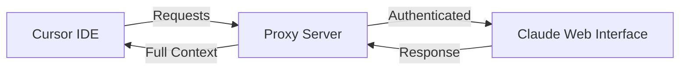

# 🚀 Cursor-Claude Connector

> **The best of both worlds**: Combine Cursor's powerful IDE with Claude's unlimited potential

## 🚀 Why combine Cursor IDE with Claude's full power?

Based on discussions on Reddit and developer communities, here's what you get:

### 💡 **Get Claude's highest quality output**

- Direct access to Claude's full capabilities
- Better context understanding without compression
- Access to the latest Claude models and features

### 🧠 **Direct model access without limitations**

- **No context compression**: Cursor compresses context to save tokens, which can degrade quality
- **No artificial limits**: No 250-line file restrictions like in Cursor
- **Full model**: Access to Claude's full power without intermediate layers

### 💰 **Significant savings**

- Cursor Pro: $20/month + additional usage costs
- Claude Max: $100-200/month (5x-20x more usage than Pro)
- **This project**: Use your Claude Max subscription in Cursor = Best value

### 🎯 **Better for complex tasks**

- Handle larger context windows and longer conversations
- Work with complex documents without hitting size restrictions
- Maintain context throughout extended coding sessions

## 🔧 How does this project work?

This proxy allows you to use your Claude Max subscription directly in Cursor, combining:

- ✅ Cursor's familiar and productive interface
- ✅ Claude's full power without limitations
- ✅ No additional costs beyond your Claude subscription

### Architecture



## 🚀 Quick Installation

### 🔥 One-Click Deploy to Vercel

Deploy instantly with Upstash Redis integration:

[](https://vercel.com/new/clone?repository-url=https://github.com/Maol-1997/cursor-claude-connector&env=API_KEY&envDescription=Custom%20optional%20key%20for%20enhanced%20security%20protection&envLink=https://github.com/Maol-1997/cursor-claude-connector%23api-key&integration-ids=oac_V3R1GIpkoJorr6fqyiwdhl17)

<!-- The integration-ids parameter includes Upstash's official Vercel integration ID for automatic Redis setup -->

This will:

- ✅ Deploy the proxy to Vercel
- ✅ Automatically create an Upstash Redis database
- ✅ Configure all environment variables (including optional API_KEY)
- ✅ Get you running in under 2 minutes!

### 📖 Manual Setup Guide

For detailed instructions or alternative deployment methods, see our **[Deployment Guide](DEPLOYMENT.md)**.

### Local Development

1. **Clone the repository**

   ```bash
   git clone https://github.com/Maol-1997/cursor-claude-connector.git
   cd cursor-claude-connector
   ```

2. **Set up Upstash Redis**

   - Create a free Redis database at [Upstash Console](https://console.upstash.com/)
   - Copy your REST URL and REST Token
   - Copy `env.example` to `.env` and update with your values:

   ```bash
   cp env.example .env
   # Edit .env with your Upstash credentials
   ```

3. **Run the start script**

   ```bash
   ./start.sh
   ```

4. **Authenticate with Claude**

   - Open `http://localhost:9095/` in your browser
   - Follow the authentication process

5. **Configure Cursor**
   - Go to Settings → Models
   - Enable "Override OpenAI Base URL"
   - Enter: `http://localhost:9095/v1` (for local) or `https://your-app.vercel.app/v1` (for Vercel)
   - If you set an API_KEY during deployment, add it to your API key field in Cursor

## 🎉 Advantages of this solution

| Feature        | Cursor Alone  | Claude Code | **This Project** |
| -------------- | ------------- | ----------- | ---------------- |
| IDE Interface  | ✅            | ❌ Terminal | ✅               |
| Full Context   | ❌ Compressed | ✅          | ✅               |
| Monthly Cost   | $20 + usage   | $100-200    | Claude Max only  |
| Code Quality   | ⭐⭐⭐        | ⭐⭐⭐⭐⭐  | ⭐⭐⭐⭐⭐       |
| Change Control | ✅            | ⚠️          | ✅               |

## 🔐 API Key (Optional)

You can optionally set an `API_KEY` environment variable for additional security:

- If set, Cursor must provide this key in the API key field
- Adds an extra layer of authentication to your proxy
- Useful when deploying to public URLs
- Leave empty to use without additional authentication

## 🛡️ Security

- Uses your existing Claude session for authentication
- Optional API key for additional security
- Local connection between Cursor and the proxy
- Open source code for auditing

## 🤝 Contributions

Contributions are welcome! If you find any issues or have suggestions, please open an issue or PR.

## 📄 License

MIT - Use this project however you want

---

**Note**: This project is not affiliated with Anthropic or Cursor. It's a community tool to improve the development experience.
